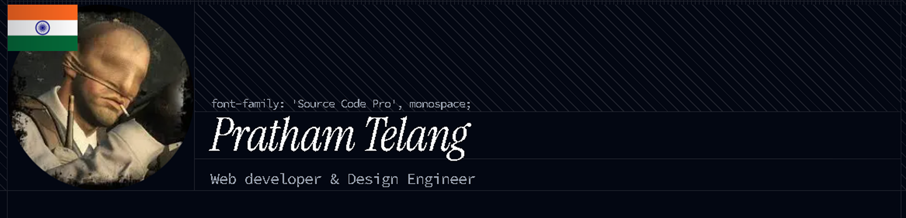

## Hi there 👋 Welcome!

I'm **Pratham Telang**  
Design Engineer & Frontend Developer

I build clean, interactive, and performance-focused web interfaces with attention to motion, typography, and usability.

---

### 🧠 Interests
- Frontend Architecture
- Interaction & Motion Design
- Design Systems
- Accessibility-first UI

---

### 🛠 Tech Stack

  

**Languages & Frameworks**
- JavaScript / TypeScript  
- React, Next.js  

**Styling & Motion**
- Tailwind CSS  
- CSS  
- Framer Motion  

**Tools**
- Git & GitHub  
- Figma  
- Vercel  

---

### 🚀 Featured Projects
- **PulseRead** – Speed reading web app  
github.com/PrathamTelang/PulseRead  
- **LinkStash** – Save & organize links  
github.com/PrathamTelang/LinkStash  
- **Portfolio**  
  prathamtelang-portfolio.vercel.app

---

### 📫 Connect with me
- Portfolio: prathamtelang-portfolio.vercel.app  
- GitHub: github.com/PrathamTelang  
- LinkedIn: www.linkedin.com/in/prathamtelang
- X : https://x.com/Prat_Telang

---

⚡ Fun fact: I enjoy blending design systems with frontend engineering.
